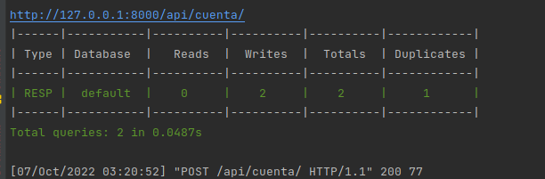
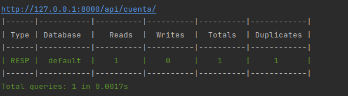
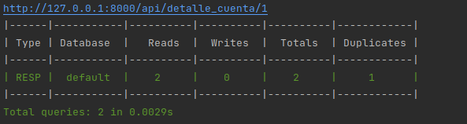
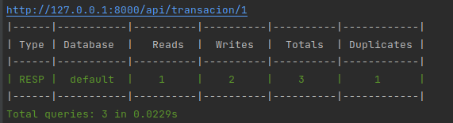
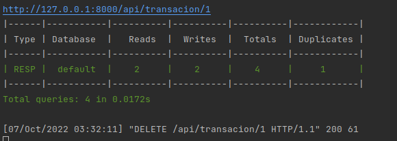
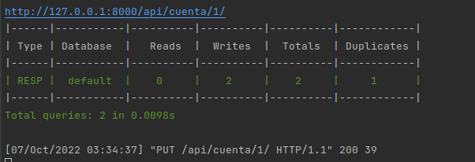
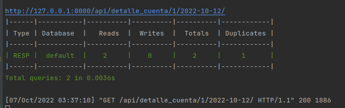
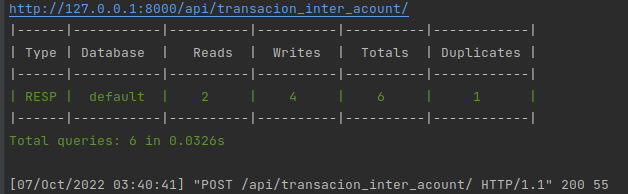

# GASTOS HOGARENOS


<!--
## Table of Contents
* [About the Project](#about-the-project)
  * [Built With](#built-with)
* [Getting Started](#getting-started)
  * [Prerequisites](#prerequisites)
  * [Installation](#installation)
* [Usage](#usage)
* [API](#api)
* [System errors](#system-errors)
* [Roadmap](#roadmap)
* [Contributing](#contributing)
* [License](#license)
* [Contact](#contact)
* [Acknowledgements](#acknowledgements)
-->
<!-- ABOUT THE PROJECT -->
## About The Project

This project is a basic microservice for house budget

### Built With
* Language: Python3
* Framework: Django
* Database: SQLite
* Services:  
* container:  


<!-- GETTING STARTED -->
## Getting Started

This is an example of how you may give instructions on setting up your project locally.
To get a local copy up and running follow these simple example steps.


### Installation 

1. Install Virtualenv and activate it
```sh
$ virtualenv -p python3 venv
```
```sh
$ source venv/bin/activate
```
2. Install requirements.txt
```sh
$ pip3 install -r requirements.txt
```
### Execution

### Exportar variables de entorno

del archivo .env.example llenar las variables y copiarlas en la terminal donde se esta ejecutando
el proyecto con el siguiente comando

```shell
      export ENV=production
```

Dependiendo del ID como pycharm se puede exportar desde la configuracion para mas detalle
https://peaku.co/es/preguntas/34856-%C2%BFcomo-establecer-variables-de-entorno-en-pycharm
### Django Server

Iniciar aplicacion

```sh
$   python manage.py makemigrations 
```

```sh
$   python manage.py migrate
```

```sh
$  python manage.py runserver
```

En la siguiente url se encutra la documentacion con swagger y rdoc

```sh
http://localhost:8000/swagger/
http://localhost:8000/redoc/
```

Para crear super usuario y poder ingresar al admin

```sh
$  python manage.py createsuperuser
```

link del admin

```sh
http://localhost:8000/admin/
```


## Resumen Queries

- Crear cuenta



- Lista cuenta



- Detalle cuenta usuario 



- Crear transaccion



- Borrar_transaccion



- Actualizar balance cuenta



- Detalle_transaciones_fecha



- Transaciones_entre_cuentas



  
## Gitflow

Para cada HU (historia de usuari) termianda, se debe
enviar en el commit el mensaje de 'DONE'.

Para desplegar a main desde la rama develop
se debe enviar el mensaje 'RELEASE'


